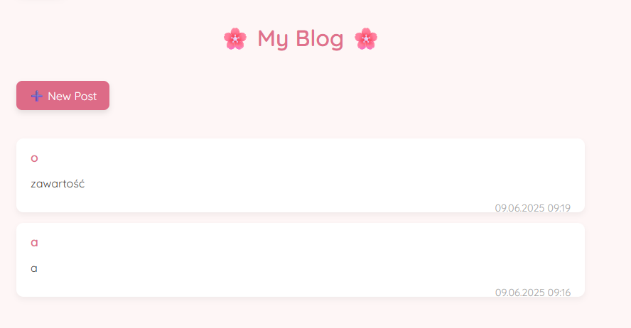
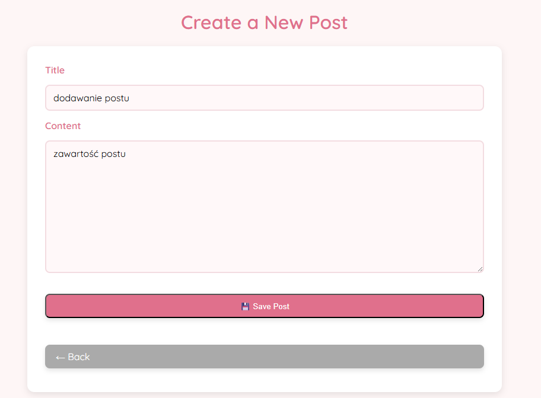

#  Flask Blog

Prosty blog stworzony przy użyciu **Flask** i **SQLite**. Pozwala na dodawanie i przeglądanie postów.

## Co zawiera

- Backend w Python (Flask)
- Baza danych SQLite (lokalnie)
- HTML + CSS (pastelowy styl, responsywny wygląd)
- System dodawania i wyświetlania postów
- Gotowe do wdrożenia na platformie Render

## Demo online

[Zobacz działającą aplikację](https://isi-blog-1.onrender.com/)

##  Zrzuty ekranu

###  Strona główna  


###  Dodawanie nowego posta  


##  Jak uruchomić lokalnie

1. Klonuj repozytorium:
   ```bash
   git clone https://github.com/twoj-uzytkownik/flask-blog.git
   cd flask-blog